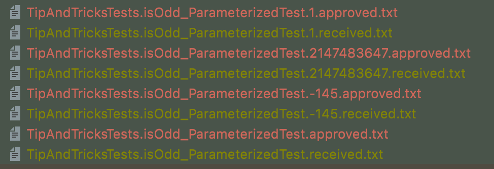
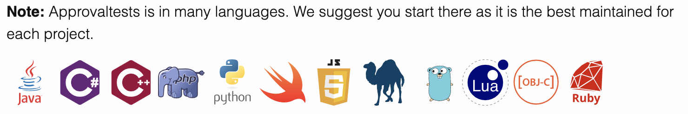

# Approval Testing by Example
## What is it ?
Also called : Characterization Tests OR Snapshot Tests or Golden Master

> A picture’s worth a 1000 tests.

* Unit testing assertions can be difficult to use and long to write
* Approval tests simplify this by taking a snapshot of the results / confirming that they have not changed at each run

This technique can be used on :
* On any new code
* On legacy code

## How to ?
* Add ApprovalTests dependency in your pom
```xml
<dependency>
    <groupId>com.approvaltests</groupId>
    <artifactId>approvaltests</artifactId>
    <version>12.1.1</version>
    <scope>test</scope>
</dependency>
```
* Configure location of the **approved.txt files
  * Add a PackageSettings file
```java
public class PackageSettings {
    public static String UseApprovalSubdirectory = "approvals";
    public static String ApprovalBaseDirectory = "../resources";
}
```
* Exclude receive files from git
  * Add those lines in your `.gitignore` file
```text
### Approval exclusion ###
*.received.txt
*.received.json
```

Documentation available [here](https://github.com/approvals/ApprovalTests.Java)

## Use Cases
### Mappers (MappingTests)
`I want to check that my Mappers are working fine / as expected`

```java
@Mapper(builder = @Builder(disableBuilder = true))
public interface PartyRequestMapper {
    @BeanMapping(qualifiedByName = "toSF")
    @Mapping(source = ".", target = ".")
    @Mapping(source = "title", target = "salutation")
    @Mapping(source = "mnemonic", target = "mnemonic__c")
    @Mapping(source = "familyName", target = "lastName")
    @Mapping(source = "firstName", target = "firstName")
    @Mapping(source = "middleName", target = "middleName")
    @Mapping(source = "birthName", target = "maidenName__pc")
    @Mapping(source = "gender", target = "finServ__Gender__pc")
    @Mapping(source = "birthDate", target = "personBirthdate")
    @Mapping(source = "birthCity", target = "cityOfBirth__pc")
    @Mapping(source = "birthCountryCode", target = "countryOfBirth__pc")
    @Mapping(source = "maritalStatus", target = "finServ__MaritalStatus__pc")
    @Mapping(source = "pepMep", target = "PEPMEPType__pc")
    @Mapping(source = "otherNationality.", target = "secondaryCitizenship__pc")
    SFPersonAccount individualDtoToSF(IndividualPartyRequestDto prospectDto);

    @Named("toSF")
    @AfterMapping
    default void mapSubEntitiesToSF(IndividualPartyRequestDto source,
                                    @MappingTarget SFPersonAccount target) {
        if (CollectionUtils.isEmpty(source.getIdentityDocument())) {
            return;
        }

        io.vavr.collection.List.ofAll(source.getIdentityDocument())
                .forEachWithIndex((element, index) -> {
                    if (index == 0) {
                        target.setLegalDocumentExpirationDate1__c(element.getIdentityDocumentExpirationDate());
                        target.setLegalDocumentIssuingCountry1__c(element.getIssuingCountryCode());
                        target.setLegalDocumentIssuingDate1__c(element.getIdentityDocumentIssueDate());
                        target.setLegalDocumentName1__c(element.getIdentityDocumentType());
                        target.setLegalDocumentNumber1__c(element.getIdentityDocumentNumber());
                    }
                    if (index == 1) {
                        target.setLegalDocumentExpirationDate2__c(element.getIdentityDocumentExpirationDate());
                        target.setLegalDocumentIssuingCountry2__c(element.getIssuingCountryCode());
                        target.setLegalDocumentIssuingDate2__c(element.getIdentityDocumentIssueDate());
                        target.setLegalDocumentName2__c(element.getIdentityDocumentType());
                        target.setLegalDocumentNumber2__c(element.getIdentityDocumentNumber());
                    }
                });
    }
}
```

* Usually we write this kind of tests / Assertions
    * Long to write the assertions
    * The assertions are really important, we may have missed something in this test
      * We don't assert that other data are null for example
      * Does it make sense from a business perspective ?
      * Should we add new assert lines ?
    * This kind of tests can be a pain to maintain
      * if you have a lot of logic in your mapper
      * if you add / remove fields
```java
@Test
void mapDTOtoSF() {
    final var prospectDto = DataBuilder.createProspectDto();
    final var mapper = Mappers.getMapper(PartyRequestMapper.class);

    final var sfPersonAccount = mapper.individualDtoToSF(prospectDto);
    assertThat(sfPersonAccount.getMnemonic__c()).isEqualTo("Johnny ?");
    assertThat(sfPersonAccount.getLastName()).isEqualTo("Capone");
    assertThat(sfPersonAccount.getFirstName()).isEqualTo("Al");
    assertThat(sfPersonAccount.getMaidenName__pc()).isEqualTo("Capone");
    assertThat(sfPersonAccount.getFinServ__Gender__pc()).isEqualTo("M");
    assertThat(sfPersonAccount.getPersonBirthdate()).isEqualTo("1908-02-09");
    assertThat(sfPersonAccount.getCityOfBirth__pc()).isEqualTo("Chicago");
    assertThat(sfPersonAccount.getCountryOfBirth__pc()).isEqualTo("US");
    assertThat(sfPersonAccount.getFinServ__MaritalStatus__pc()).isEqualTo("Divorced");
    assertThat(sfPersonAccount.getLegalDocumentIssuingCountry1__c()).isEqualTo("US");
    assertThat(sfPersonAccount.getLegalDocumentIssuingDate1__c()).isEqualTo("2020-02-02");
    assertThat(sfPersonAccount.getLegalDocumentName1__c()).isEqualTo("PI");
    assertThat(sfPersonAccount.getLegalDocumentIssuingCountry1__c()).isEqualTo("US");
    assertThat(sfPersonAccount.getLegalDocumentNumber1__c()).isEqualTo("090808988");
    assertThat(sfPersonAccount.getLegalDocumentExpirationDate1__c()).isEqualTo("2025-02-02");
}
```

* Simplify your asserts with approval
```java
@Test
void mapDTOtoSF_with_approval() {
    final var mapper = Mappers.getMapper(PartyRequestMapper.class);
    final var prospectDto = DataBuilder.createProspectDto();
    
    Approvals.verify(mapper.individualDtoToSF(prospectDto));
}
```
* When you run this test for the first time :
  * It generates 2 files :
    * `MappingTests.mapDTOtoSF_with_approval.received.txt`
      * Contains the printed version of `mapper.individualDtoToSF(prospectDto)`
    * `MappingTests.mapDTOtoSF_with_approval.approved.txt`
  * Then compares the 2 files
    * Simple Text comparison

* Once you have verified the received version and agreed with your business that everything is OK
  * Copy the content from the received file inside the approved one
  * Run the test again
    * The test is now green
    * You are covered against regression with much less code / maintenance

* You can test the regression by deleting 1 mapping line

### Work on "Legacy code" aka code without tests (TemplateRetrieverTests)
`I need to add a logic into a piece of code but there is no test on it so I am afraid to break existing behavior`

* Imagine this code is running in production
  * You need to change it / extract the logic `fromDocumentTypeAndRecordType` in a `TemplateRetriever` class
  * But first, you want to be sure to not introduce regression / have a safety net
```java
@Getter
public enum DocumentTemplateType {
    DEERPP("DEER", SFRecordType.INDIVIDUAL_PROSPECT, "DEERPP", "DEERPP.ftl"),
    DEERPM("DEER", SFRecordType.LEGAL_PROSPECT, "DEERPM", "DEERPM.ftl"),
    AUTP("AUTP", SFRecordType.INDIVIDUAL_PROSPECT, "FSI1LSCI_CBS", "AUTP.ftl"),
    AUTM("AUTM", SFRecordType.LEGAL_PROSPECT, "FSI1LSCE_CBS", "AUTM.ftl"),
    SPEC("SPEC", SFRecordType.ALL, "SIGNSPEC", "SPEC.ftl"),
    GLPP("GLPP", SFRecordType.INDIVIDUAL_PROSPECT, "GUIDEPP", "GLPP.ftl"),
    GLPM("GLPM", SFRecordType.LEGAL_PROSPECT, "GUIDEPM", "GLPM.ftl");

    private final String documentType;
    private final SFRecordType recordType;
    private final String templateId;
    private final String templateFile;

    DocumentTemplateType(String documentType, SFRecordType recordType, String templateId, String templateFile) {
        this.documentType = documentType;
        this.recordType = recordType;
        this.templateId = templateId;
        this.templateFile = templateFile;
    }

    public static DocumentTemplateType fromDocumentTypeAndRecordType(String documentType, String recordType) {
        for (DocumentTemplateType dtt : DocumentTemplateType.values()) {
            if (dtt.getDocumentType().equalsIgnoreCase(documentType)
                    && dtt.getRecordType().equals(SFRecordType.valueOf(recordType))) {
                return dtt;
            } else if (dtt.getDocumentType().equalsIgnoreCase(documentType)
                    && dtt.getRecordType().equals(SFRecordType.ALL)) {
                return dtt;
            }
        }
        throw new IllegalArgumentException("Invalid Document template type or record type");
    }
}
```
* Let's add some tests
  * We have plenty of possible combinations
  * We could use `ParameterizedTests` to make those assertions
```java
@Test
void given_glpp_and_individual_prospect_should_return_glpp() {
    final var result = DocumentTemplateType.fromDocumentTypeAndRecordType("GLPP", "INDIVIDUAL_PROSPECT");
    assertThat(result).isEqualTo(DocumentTemplateType.GLPP);
}

@Test
void given_glpp_and_legal_prospect_should_throws_IllegalArgumentException() {
    Assertions.assertThrows(IllegalArgumentException.class,
            () -> DocumentTemplateType.fromDocumentTypeAndRecordType("GLPP", "LEGAL_PROSPECT"));
}
```

* Instead, let's use the power of Approval !!!
  
* We can generate combinations and have only 1 approved file by using `CombinationApprovals.verifyAllCombinations`
```java
@Test
void combinationTests() {
    CombinationApprovals.verifyAllCombinations(
            DocumentTemplateType::fromDocumentTypeAndRecordType,
            new String[]{"AUTP", "AUTM", "DEERPP", "DEERPM", "SPEC", "GLPP", "GLPM"},
            new String[]{"INDIVIDUAL_PROSPECT", "LEGAL_PROSPECT", "ALL"}
    );
}
```
* We can even improve it by making this test totally dynamic
  * If we add a new Enum entry the test will fail
  * Forcing us to approve the new version of the test output
```java
@Test
void combinationTestsV2() {
    CombinationApprovals.verifyAllCombinations(
            DocumentTemplateType::fromDocumentTypeAndRecordType,
            Arrays.stream(DocumentTemplateType.values()).map(Enum::name).toArray(String[]::new),
            Arrays.stream(SFRecordType.values()).map(Enum::name).toArray(String[]::new)
    );
}
```
* Then we can refactor
```java
private final static Map<String, DocumentTemplateType> mapping =
        List.of(DocumentTemplateType.values())
                .toMap(v -> formatKey(v.getDocumentType(), v.getRecordType().name()), v -> v)
                .merge(List.of(SFRecordType.values()).toMap(v -> formatKey(SPEC.name(), v.name()), v -> SPEC));

private static String formatKey(String documentType, String recordType) {
    return documentType.toUpperCase() + "-" + recordType.toUpperCase();
}

public static DocumentTemplateType fromDocumentTypeAndRecordTypeV2(String documentType, String recordType) {
    return mapping.get(formatKey(documentType, recordType))
            .getOrElseThrow(() -> new IllegalArgumentException("Invalid Document template type or record type"));
}
```

> With this technique, we can create tests in a black box way before refactoring

### Integration tests with Spring Boot (DemoControllerHttpTests)
`I want to write integration tests but do not want to spend half of my time writing assertions`

```java
@RestController
public class DemoController {
    @GetMapping("/")
    public ResponseEntity<IndividualPartyRequestDto> getProspect() {
        return ResponseEntity.ok(DataBuilder.createProspectDto());
    }
}
```
* Call the Controller through HTTP and deserialize the object
```java
@Test
void using_deserialized_object() throws Exception {
    final var result = this.mockMvc.perform(get("/"))
            .andExpect(status().isOk())
            .andReturn();
    
    final var response = objectMapper.readValue(result.getResponse().getContentAsString(), IndividualPartyRequestDto.class);
            assertThat(response.getMnemonic()).isEqualTo("Johnny ?");
            assertThat(response.getFamilyName()).isEqualTo("Capone");
            assertThat(response.getFirstName()).isEqualTo("Al");
            assertThat(response.getBirthName()).isEqualTo("Capone");
            assertThat(response.getGender()).isEqualTo("M");
            assertThat(response.getBirthDate()).isEqualTo("1908-02-09");
            assertThat(response.getBirthCity()).isEqualTo("Chicago");
            assertThat(response.getBirthCountryCode()).isEqualTo("US");
            assertThat(response.getMaritalStatus()).isEqualTo("Divorced");
            assertThat(response.getIdentityDocument().size()).isEqualTo(1);
            assertThat(response.getIdentityDocument().get(0).getIdentityDocumentExpirationDate()).isEqualTo("2025-02-02");
            assertThat(response.getIdentityDocument().get(0).getIdentityDocumentNumber()).isEqualTo("090808988");
            assertThat(response.getIdentityDocument().get(0).getIdentityDocumentType()).isEqualTo("PI");
            assertThat(response.getIdentityDocument().get(0).getIssuingCountryCode()).isEqualTo("US");
            assertThat(response.getIdentityDocument().get(0).getIdentityDocumentIssueDate()).isEqualTo("2020-02-02");
}
```
* Or easier : use json path
```java
@Test
void using_json_path() throws Exception {
    this.mockMvc.perform(get("/"))
            .andExpect(status().isOk())
            .andExpect(jsonPath("$.mnemonic", is("Johnny ?")))
            .andExpect(jsonPath("$.familyName", is("Capone")))
            .andExpect(jsonPath("$.firstName", is("Al")))
            .andExpect(jsonPath("$.birthName", is("Capone")))
            .andExpect(jsonPath("$.gender", is("M")))
            .andExpect(jsonPath("$.birthDate", is("1908-02-09")))
            .andExpect(jsonPath("$.birthCity", is("Chicago")))
            .andExpect(jsonPath("$.birthCountryCode", is("US")))
            .andExpect(jsonPath("$.maritalStatus", is("Divorced")))
            .andExpect(jsonPath("$.identityDocument[0].identityDocumentNumber", is("090808988")))
            .andExpect(jsonPath("$.identityDocument[0].identityDocumentType", is("PI")))
            .andExpect(jsonPath("$.identityDocument[0].issuingCountryCode", is("US")))
            .andExpect(jsonPath("$.identityDocument[0].identityDocumentIssueDate", is("2020-02-02")))
            .andExpect(jsonPath("$.identityDocument[0].identityDocumentExpirationDate", is("2025-02-02")));
}
```
* Or even easier : use Approval
```java
@Test
void using_approval() throws Exception {
    Approvals.verify(this.mockMvc.perform(get("/"))
            .andExpect(status().isOk())
            .andReturn()
            .getResponse()
            .getContentAsString()
    );
}
```

```text
{"title":null,"mnemonic":"Johnny ?","familyName":"Capone","firstName":"Al","middleName":null,"birthName":"Capone","gender":"M","birthDate":"1908-02-09","birthCity":"Chicago","birthCountryCode":"US","maritalStatus":"Divorced","spokenLanguage":null,"pepMep":null,"otherNationality":null,"identityDocument":[{"identityDocumentNumber":"090808988","identityDocumentType":"PI","issuingCountryCode":"US","identityDocumentIssueDate":"2020-02-02","identityDocumentExpirationDate":"2025-02-02"}]}
```

* A little shitty right ?
  * We can use the verifyJson method to have a prettier version of the json

```java
@Test
void using_approval_json() throws Exception {
    Approvals.verifyJson(this.mockMvc.perform(get("/"))
            .andExpect(status().isOk())
            .andReturn()
            .getResponse()
            .getContentAsString()
    );
}
```

```json
{
  "mnemonic": "Johnny ?",
  "familyName": "Capone",
  "firstName": "Al",
  "birthName": "Capone",
  "gender": "M",
  "birthDate": "1908-02-09",
  "birthCity": "Chicago",
  "birthCountryCode": "US",
  "maritalStatus": "Divorced",
  "identityDocument": [
    {
      "identityDocumentNumber": "090808988",
      "identityDocumentType": "PI",
      "issuingCountryCode": "US",
      "identityDocumentIssueDate": "2020-02-02",
      "identityDocumentExpirationDate": "2025-02-02"
    }
  ]
}
```

### Non deterministic output (DemoControllerHttpTests)
`I have some "non deterministic" data in my print result like UUID or Dates, how can I handle them ?`

Example :
```json
{
  "id": "4f26cd50-b435-41a8-bb19-fadfa0aa4943",
  "firstName": "Jacques",
  "lastName": "Mesrine"
}
```

* If you are having trouble getting tests running reproducibly :
  * Might need to use a “scrubber” to convert the non-deterministic text to something stable
  * A `scrubber` is function that takes a string and returns a string


* Use Scrubbers in Option of your verify :
```java

@Test
void using_approval_with_scrubber() throws Exception {
        Approvals.verifyJson(this.mockMvc.perform(get("/dynamicData"))
              .andExpect(status().isOk())
              .andReturn()
              .getResponse()
              .getContentAsString(),
        new Options(Scrubbers::scrubGuid));
    }
}
```
* File is now looking like this
  * If there were some correlations to make, it will do it for us
```json
{
  "id": "guid_1",
  "firstName": "Jacques",
  "lastName": "Mesrine"
}
```

More about Scrubbers [here](https://github.com/approvals/ApprovalTests.Java/blob/master/approvaltests/docs/Scrubbers.md#top
)

## Tips & Tricks
### Does it work with ParameterizedTest ?
* By default, it generates 1 file per test
* Here we want to have 1 file per Value
```java
@ParameterizedTest
@ValueSource(ints = {1, -145, Integer.MAX_VALUE})
void isOdd_ParameterizedTest(int number) {
    // Add the try block in your test
    try (NamedEnvironment env = NamerFactory.withParameters(number)) {
        Approvals.verify(isOdd(number));
    }
}
```


More about ParameterizedTests [here](https://github.com/approvals/ApprovalTests.Java/blob/master/approvaltests/docs/how_to/ParameterizedTest.md#top)
### The `toString()` of my object is not readable at all, how do I do ?
3 solutions
* Change the `toString()` implementation in your Production code
* Use a Printable Wrapper (you can select only stuff you are interested in)
```java
@Test
void mapDTOtoSF_with_printable_wrapper() {
    final var mapper = Mappers.getMapper(PartyRequestMapper.class);
    final var prospectDto = DataBuilder.createProspectDto();
    final var result = mapper.individualDtoToSF(prospectDto);
    final var printableProspect = new Printable<>(result, person -> person.getFirstName() + "," + person.getLastName());

    Approvals.verify(printableProspect);
}
```
* Use Approval lib generate a pretty version of our object (json or xml)
  * By using methods `verifyAsJson` / `verifyAsXml`
```java
@Test
void mapDTOtoSF_with_verify_json() {
    final var mapper = Mappers.getMapper(PartyRequestMapper.class);
    final var prospectDto = DataBuilder.createProspectDto();

    Approvals.verifyAsJson(mapper.individualDtoToSF(prospectDto));
}
```

## FAQ
* Does this lib exist in other languages ?
  * More about it [here](https://approvaltests.com/)

* I am working mainly on front-end development, could I use the same principle ?
  * Here is an equivalent with [Jest](https://jestjs.io/en/docs/snapshot-testing)
      * It's called snapshot tests on the Front side

## To go further
If you want to go further, [here](https://yoan-thirion.gitbook.io/knowledge-base/software-craftsmanship/code-katas/gilded-rose-approval-testing) is a refactoring kata demonstrating :
* The power of Approval Testing when you have to deal with Legacy code
* That Code Coverage can be a powerful tool
* That Mutation Testing is a prerequisite when you work with this kind of code 